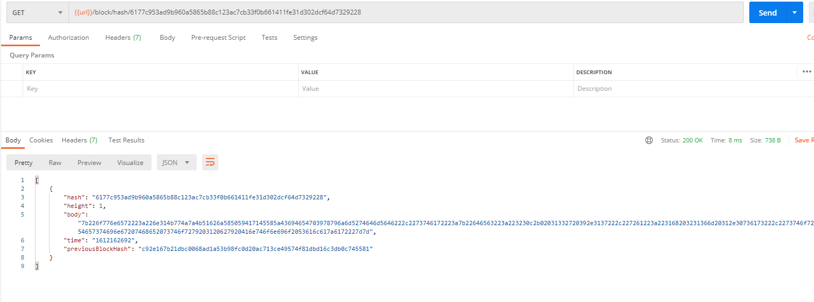

# Private Blockchain Application

You are starting your journey as a Blockchain Developer, this project allows you to demonstrate
that you are familiarized with the fundamentals concepts of a Blockchain platform.
Concepts like:
    - Block
    - Blockchain
    - Wallet
    - Blockchain Identity
    - Proof of Existance

Are some of the most important components in the Blockchain Framework that you will need to describe and also
why not? Implement too.

# Results

This are a couple screenshots of the endpoint responses

GET - Block by it's height "\block\:height"

POST - Able to request ownership

Able to sign a message with my wallet

POST - Able to submit a star

POST - Able to retrieve stars owned by me

POST - Able to retrive a block by it's hash

GET - Able to validate a blockchain

**Please review the code for this last endpoint, the validate method in the Block class, Im not quite sure this is working how it supposed to be :)

Thank you! :heart: and stay safe :pray:

by  [Antonio Salazar](https://www.linkedin.com/in/antonio-salazar-esquivel/)
 
